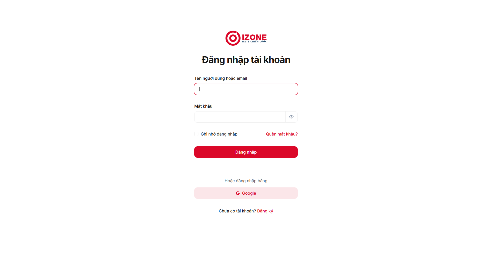
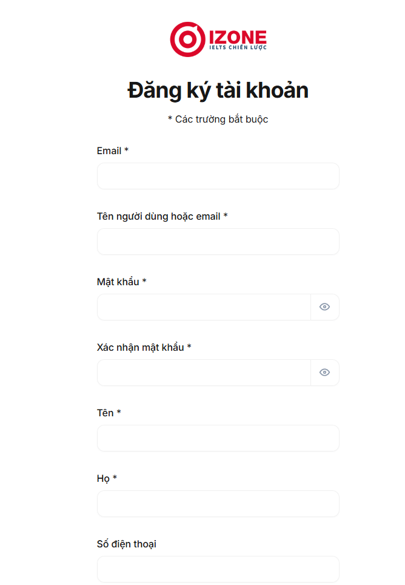
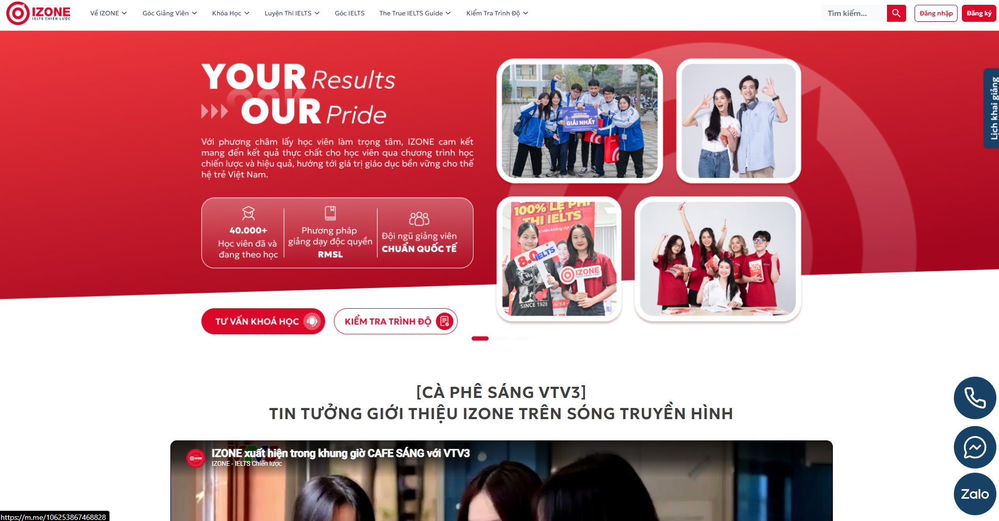
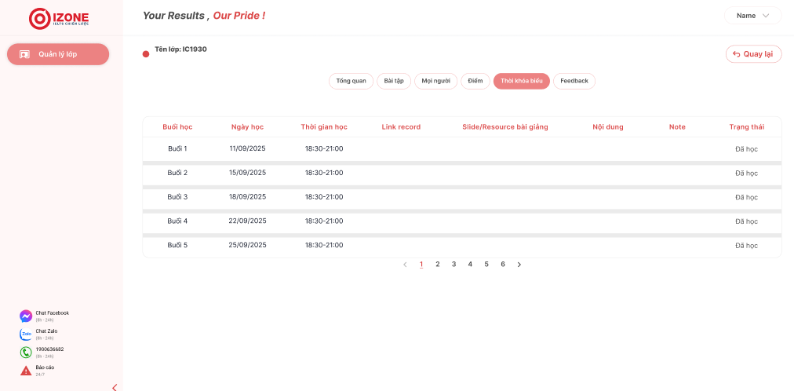
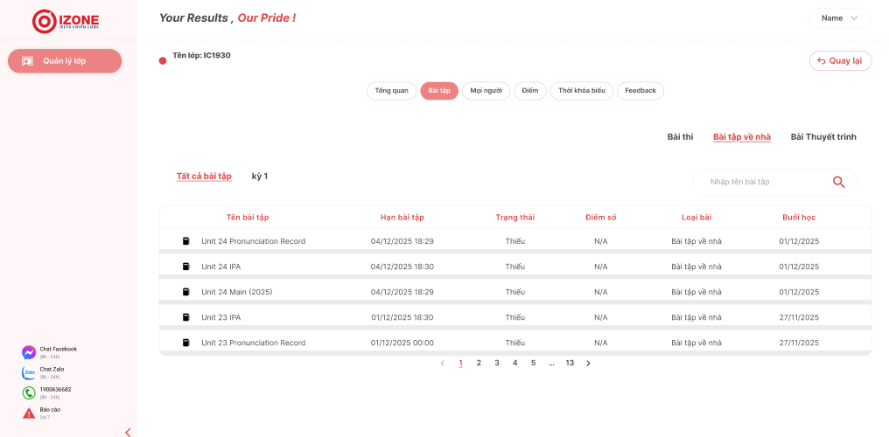
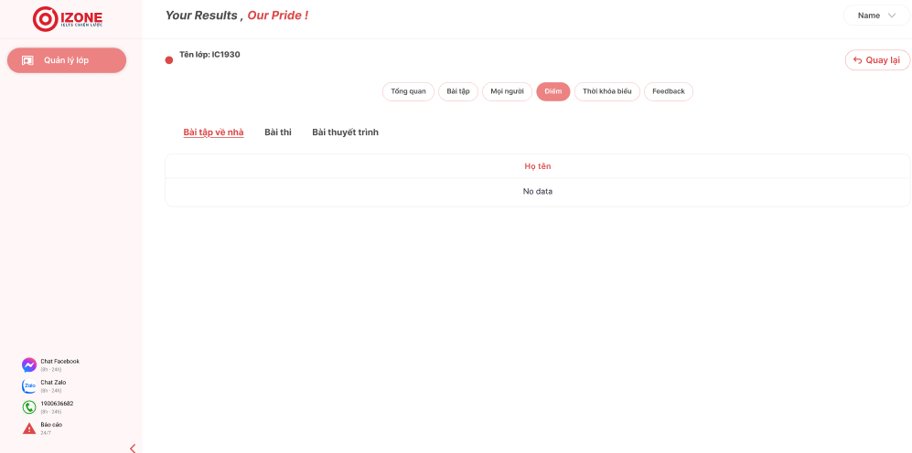

# KIẾN TRÚC GIAO DIỆN & ĐẶC TẢ MÀN HÌNH (UI-DESIGN)

> **LƯU Ý CHO AI CHẠY DỰ ÁN:** Các hình ảnh tham chiếu dưới đây có thể chứa dữ liệu mẫu hoặc logo từ các hệ thống khác (như IZONE). Khi sinh mã nguồn (Code Generation), AI bắt buộc phải giữ nguyên Bố cục (Layout)/Hệ màu (Colors) từ ảnh, nhưng phải tự động đổi "Ruột" (Thông tin/Dữ liệu) sang đúng các thực thể dữ liệu của dự án **ezone**.

---

## I. HỆ THỐNG THÀNH PHẦN CHUNG (GLOBAL DESIGN TOKENS)
- **Hệ màu chủ đạo (Theme Colors):**
  - `Primary:` #CE1835 (Đỏ sẫm chủ đạo - Nút bấm chính, Logo, Trạng thái Active).
  - `Accent:` #FDF0F1 (Hồng nhạt cực nhẹ - Nền Sidebar, Nền thẻ phụ).
  - `Text-Main:` #000000 (Đen tuyền - Tiêu đề lớn).
  - `Text-Body:` #333333 (Xám đậm - Nội dung, Nhãn nhập liệu).
  - `Borders:` #DEDEDE (Xám nhạt - Đường viền Input, Viền bảng).
- **Cấu trúc font & bo góc:** Font Sans-serif (Inter/Roboto), Bo góc (Border-radius) đồng bộ cho Button/Input từ 6px - 8px.

---

## II. PHÂN HỆ XÁC THỰC & HỆ THỐNG (AUTH SYSTEM)

### 1. Màn hình Đăng nhập (UC01 - LOGIN)
- **Ảnh tham chiếu Figma:** 
- **Nghiệp vụ ezone:** Xác thực tài khoản người dùng dựa trên bảng `USERS`.
- **Đặc tả Component:**
  - `AppLogo:` Logo chính thức của **ezone** (Thay thế cho logo mẫu trong ảnh).
  - `AuthForm:` Gồm trường Username/Email, Password (có icon 👁️ ẩn/hiện), nút "Ghi nhớ" và "Quên mật khẩu".
  - `SubmitButton:` Màu đỏ `Primary`, text trắng "Đăng nhập".
  - `SocialAuth:` Nút đăng nhập nhanh bằng Google (Nền màu `Accent`).

### 2. Màn hình Đăng ký Tài khoản (UC07 - REGISTER)
- **Ảnh tham chiếu Figma:** 
- **Nghiệp vụ ezone:** Cho phép Khách (Guest) tự tạo tài khoản mới thuộc vai trò Học viên vào bảng `USERS`.
- **Đặc tả Component:** Form đăng ký chuẩn gồm: Họ tên, Email, Số điện thoại, Mật khẩu và Xác nhận mật khẩu.

---

## III. PHÂN HỆ LANDING PAGE (PUBLIC - DÀNH CHO GUEST)

### 3. Trang chủ & Danh mục Khóa học (UC04, UC05 - COURSES_CATALOG)
- **Ảnh tham chiếu Figma:** 
- **Nghiệp vụ ezone:** Truy xuất dữ liệu từ `COURSES_CATALOG` và danh sách giảng viên `INSTRUCTORS`.
- **Đặc tả Component:** - `Header/Navbar:` Chứa menu điều hướng công khai và nút Đăng nhập/Đăng ký.
  - `CourseGrid:` Danh sách các khóa học hiển thị dưới dạng thẻ (Card), có nút "Xem chi tiết" và "Đăng ký tư vấn" (`ENROLLMENTS`).

---

## IV. PHÂN HỆ LMS - DÀNH CHO HỌC VIÊN (STUDENT)

### 4. Thời khóa biểu & Buổi học (UC10 - CLASS_SESSIONS)
- **Ảnh tham chiếu Figma:** 
- **Nghiệp vụ ezone:** Hiển thị lịch học cụ thể của các lớp mà Student tham gia (`CLASS_MEMBERS`), dữ liệu lấy từ `CLASS_SESSIONS`.
- **Đặc tả Component:** Giao diện dạng lịch (Calendar) hoặc danh sách dòng thời gian. Mỗi buổi học hiển thị: Ngày, Giờ, Phòng học và Link học trực tuyến bên ngoài (nếu có).

### 5. Kho tài liệu & Bài tập (UC11, UC12 - MATERIALS & ASSIGNMENTS)
- **Ảnh tham chiếu Figma:** 
- **Nghiệp vụ ezone:** Tải tài liệu từ `MATERIALS` và theo dõi danh sách bài tập từ `ASSIGNMENTS`.
- **Đặc tả Component:** - `MaterialList:` Danh sách các tệp PDF/Word tài liệu đi kèm nút Tải xuống.
  - `AssignmentCard:` Thẻ bài tập hiển thị rõ Hạn nộp (Deadline), nút bấm mở Form để đẩy file bài làm lên bảng `SUBMISSIONS`.

### 6. Tra cứu Kết quả & Điểm danh (UC13 - SCORES & ATTENDANCE)
- **Ảnh tham chiếu Figma:** 
- **Nghiệp vụ ezone:** Xem điểm từ `SCORES` và lịch sử điểm danh từ `ATTENDANCE`.
- **Đặc tả Component:** Bảng thống kê tỷ lệ chuyên cần (Có mặt / Vắng / Muộn) và bảng điểm số kèm lời nhận xét từ giảng viên.

---

## V. PHÂN HỆ LMS - DÀNH CHO GIẢNG VIÊN (TEACHER)

### 7. Nhật ký lớp học & Quản lý Buổi học (UC14 - CLASS_LOG)
- **Ảnh tham chiếu Figma:** ![Chi tiết lớp học]
- **Nghiệp vụ ezone:** Quản lý thông tin lớp (`CLASSES`) và hiển thị dòng lịch sử hoạt động, tài liệu đã giao thuộc lớp đó.
- **Đặc tả Component:**
  - `SidebarLayout:` Menu quản lý lớp nền hồng nhạt `Accent`. 
  - `TabGroup:` Bộ nút chuyển đổi tab nhanh: [Tổng quan, Bài tập, Mọi người, Điểm, Thời khóa biểu].
  - `ActivityStream:` Dòng thời gian danh sách bài tập/tài liệu đã thêm vào lớp theo thứ tự ngày tháng giảm dần.

### 8. Ghi nhận Điểm danh (UC15 - ATTENDANCE MANAGE)
- **Ảnh tham chiếu Figma:** ![Giao diện Điểm danh]
- **Nghiệp vụ ezone:** Giảng viên tích chọn và cập nhật trạng thái chuyên cần trực tiếp vào bảng `ATTENDANCE`.
- **Đặc tả Component:** Bảng (Table) danh sách học viên trong lớp, cột trạng thái sử dụng các nút Radio Button hoặc Checkbox: [Có mặt], [Muộn], [Vắng].

### 9. Chấm bài & Nhận xét (UC18 - GRADING)
- **Ảnh tham chiếu Figma:** ![Giao diện Chấm bài]
- **Nghiệp vụ ezone:** Đánh giá các tệp học viên nộp trong `SUBMISSIONS` và cập nhật điểm số vào hệ thống.
- **Đặc tả Component:** Danh sách bài làm của học viên. Khi chọn một học viên sẽ mở ra form nhập Điểm số (Số thực) và ô TextBox nhập Nhận xét (Văn bản).

---

## VI. PHÂN HỆ QUẢN TRỊ (ADMIN DASHBOARD)

### 10. Quản lý Người dùng & Lớp học (UC19, UC21 - USERS & CLASSES)
- **Ảnh tham chiếu Figma:** ![Quản trị Dashboard Admin]
- **Nghiệp vụ ezone:** Thêm, sửa, khóa tài khoản `USERS`, phân quyền Role, và khởi tạo lớp mới `CLASSES` (chỉ định giảng viên).
- **Đặc tả Component:** Bảng quản trị dữ liệu quy mô lớn (Data Table), có thanh tìm kiếm, bộ lọc theo Role/Trạng thái và các nút tác vụ (Thêm, Sửa, Khóa).

### 11. Phê duyệt & Đối soát Học phí (UC22, UC23 - PAYMENTS)
- **Ảnh tham chiếu Figma:** ![Phê duyệt Học phí Admin]
- **Nghiệp vụ ezone:** Xem ảnh minh chứng/hóa đơn học viên gửi lên bảng `PAYMENTS`, Admin kiểm tra và nhấn nút Phê duyệt thủ công để thêm học viên vào `CLASS_MEMBERS`.
- **Đặc tả Component:** Danh sách đơn hàng chờ duyệt, giao diện hiển thị popup ảnh hóa đơn lớn để đối soát trực quan, kèm 2 nút tác vụ: [Phê duyệt] (Màu xanh) và [Từ chối] (Màu đỏ).